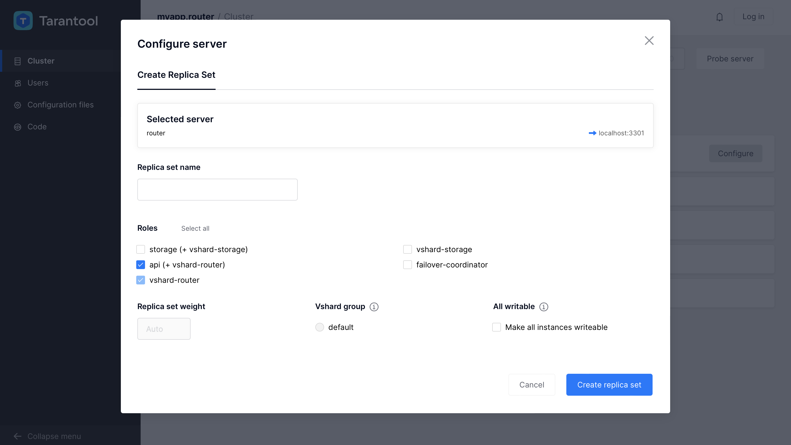
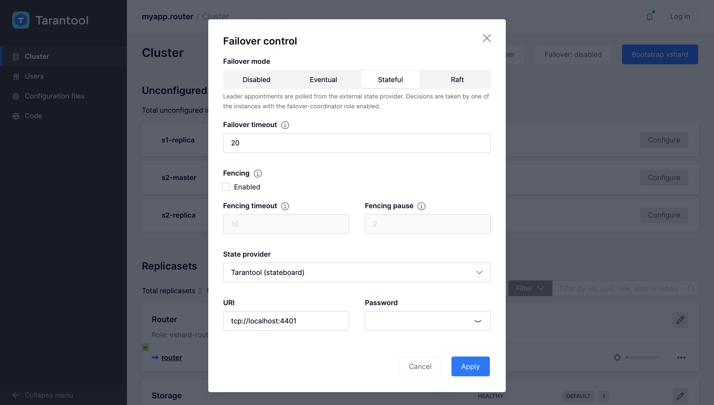

# Application example based on Tarantool Cartridge

## The challenge

Here we'll show how to implement a simple yet illustrative cluster database
for managing accounts in a bank.

Features:

1. Database:
   * Adding a new user with accounts.
   * Reading information about a user and her accounts.
   * Updating accounts.
2. Ability to work with the cluster like with a RESTful server via the
   http protocol.
3. Tests based on luatest.

## Setting up the environment

Before you start developing with `cartridge`, you need to install several utilities:

* `git` &mdash; version control system (see details [here](https://git-scm.com/))
* `cmake` version 2.8 or higher
* `tarantool-devel` &mdash; developer package for `tarantool`
* `gcc` &mdash; `C` compiler (see details [here](https://gcc.gnu.org/))
* `unzip`

To create your project in a quick and easy manner, install the latest tagged version of `cartridge-cli`
tool (not `scm-1` version).

To see available versions of cartrdge-cli, say:
```bash
you@yourmachine $ tarantoolctl rocks search cartridge-cli
```

You should see something like that:
```
cartridge-cli - Search results for Lua 5.1:
===========================================


Rockspecs and source rocks:
---------------------------

cartridge-cli
   scm-1 (rockspec) - http://rocks.tarantool.org
   1.7.0-1 (rockspec) - http://rocks.tarantool.org
   1.6.0-1 (rockspec) - http://rocks.tarantool.org
   1.5.0-1 (rockspec) - http://rocks.tarantool.org
   ...
```

The latest tagged version of `cartridge-cli` at the moment of writing this article is `1.7.0-1`.
So in this case you need to install `1.7.0-1` version. Just say this:

```bash
you@yourmachine $ tarantoolctl rocks install cartridge-cli 1.7.0
```

Also you should add `.rocks/bin` to the executable path:
```bash
you@yourmachine $ export PATH=$PWD/.rocks/bin/:$PATH
```

Now you are ready to go!

## Easy way to get an example

You can immediately see what you get at the end of this lesson: just clone
the project from the repository and run the ready-made solution:

```bash
you@yourmachine $ git clone https://github.com/tarantool/cartridge-cli
you@yourmachine $ cd cartridge-cli/examples/getting-started-app
```

After that, go to the section [" Launching the project"](#Launching-the-project)
and follow the steps indicated there.

But we don't recommend this cheat: to get deeper understanding of the example,
perform all of these steps yourself.

## Creating the project

We don't need to create the project from grounds up &mdash; just use a template.
For now we have single template: `cartridge`.

In this example we'll be using the `cartridge` template because further we'll need
to shard our solution.

Let's create a project from the template. Our project name will be
**`getting-started-app`** (you can choose any name you like).

```bash
you@yourmachine $ cartridge create --name getting-started-app
```

In the end of the output, we'll see the following message:

```bash
Application successfully created in './getting-started-app'
```

Now let's take a closer look at the structure of the created project:

```bash
you@yourmachine $ cd getting-started-app
getting-started-app $ find . -not -path '*/\.*'
.
./init.lua
./app
./app/roles
./app/roles/custom.lua
./test
./test/unit
./test/unit/sample_test.lua
./test/integration
./test/integration/api_test.lua
./test/helper.lua
./test/helper
./test/helper/unit.lua
./test/helper/integration.lua
./cartridge.post-build
./Dockerfile.build.cartridge
./getting-started-app-scm-1.rockspec
./instances.yml
./deps.sh
./cartridge.pre-build
./tmp
./Dockerfile.cartridge
```

In fact, there are many more objects in the template &mdash; at least because we
initialize a `git` repository with a `.gitignore` file. For now let's focus only
on the following files and directories:

1. ```deps.sh``` &mdash; a one-liner to easily install dev dependencies
  (`luatest`, `luacheck`, `luacov` etc.).
2. ```init.lua``` &mdash; an entry point for our application. In ths example, we won't
   go deep into the details of this script, but to develop a more complex system
   you'll need to be aware of what this script is doing.
3. ```app/roles``` &mdash; our main work directory. Here we'll define all our roles.
4. ```getting-started-app-scm-1.rockspec``` &mdash; a _"rockspec"_, i.e. a manifest
   file of our project. In this tutorial, we discuss only a small part of it
   which deals with project dependencies.

## First launch

Already at this stage, right after created from the template, our project
is nearly ready to launch. All we need to do is pull dependencies.
We can do it by running this in the project root:

```bash
getting-started-app $ cartridge build
```

All the modules we need must get pulled to the `.rocks` directory.

If we fail to pull dependencies, the project will fail to launch, and we'll see
a message like this:

```bash
getting-started-app $ tarantool init.lua
init.lua:62: module 'cartridge' not found:No LuaRocks module found for cartridge
    no field package.preload['cartridge']
    no file '/Users/aleksander.kuznetsov/projects/getting-started-app/cartridge.lua'
    no file '/Users/aleksander.kuznetsov/projects/getting-started-app/cartridge/init.lua'
    no file '/Users/aleksander.kuznetsov/projects/getting-started-app/cartridge.dylib'
    no file '/Users/aleksander.kuznetsov/projects/getting-started-app/cartridge.so'
    ...
```

Let's install dev dependencies (e.g `luatest`, `luacheck`, `luacov`) right away:

```bash
getting-started-app $ ./deps.sh
```

If we pulled dependencies in a proper way and the `.rocks` directory was created,
we can launch an "empty" instance:

```bash
getting-started-app $ tarantool init.lua
Using advertise_uri "localhost:3301"
Membership encryption enabled
Membership BROADCAST sent to 127.0.0.1:3302
Membership BROADCAST sent to 192.168.43.255:3302
Membership BROADCAST sent to 127.0.0.1:3301
Membership BROADCAST sent to 192.168.43.255:3301
Membership BROADCAST sent to 127.0.0.1:3300
Membership BROADCAST sent to 192.168.43.255:3300
started
Listening HTTP on 0.0.0.0:8081
Ready for bootstrap
entering the event loop
```

Mind this line:

```bash
Listening HTTP on 0.0.0.0:8081
```

This means that the http server is launched and listens on port 8081 of our computer.
We can navigate to http://127.0.0.1:8081 in a browser and see the cluster's web interface,
which shows that our cluster consists a single Tarantool instance.

Now let's stop the application with Ctrl+C and start writing the code.

## About roles

Role is part of our application, which is logically different from the other parts.

To implement a role that will be working in the cluster, you need &mdash; apart from
coding the business logic for this role &mdash; to code several callback functions
that the cluster will be using to manage the role's life cycle.

There are just a few functions, and nearly all of them were implemented as stubs
when we created our project from the template. Here is what we can find in
`app/roles/custom.lua`:

* `init(opts)` &mdash; creating and initializing the role.
* `stop()` &mdash; stopping the role;
* `validate_config(conf_new, conf_old)` &mdash; validating new configuration for the role;
* `apply_config(conf, opts)` &mdash; applying new configuration.

The role file itself is a Lua module, with a list of functions and variables that
the modules exports:

```lua
return {
    role_name = 'custom_role',
    init = init,
    stop = stop,
    validate_config = validate_config,
    apply_config = apply_config,
    dependencies = {},
}
```

Let's split our application into two roles:

1. The `storage` role implements storing and changing information about
   customers and accounts.
1. The `api` role implements a RESTful http server.

## Implementing business logic

### The `storage` role

Let's create a new file where we'll be implementing this role:

```bash
getting-started-app $ touch app/roles/storage.lua
```

1. Require the necessary modules:

    ```lua
    -- module for checking arguments in functions
    local checks = require('checks')

    -- module for working with numbers
    local decnumber = require('ldecnumber')
    ```

1. Implement space initialization in the storage:

    ```lua
    local function init_spaces()
        local customer = box.schema.space.create(
            -- name of the space for storing customers
            'customer',
            -- extra parameters
            {
                -- format for stored tuples
                format = {
                    {'customer_id', 'unsigned'},
                    {'bucket_id', 'unsigned'},
                    {'name', 'string'},
                },
                -- creating the space only if it doesn't exist
                if_not_exists = true,
            }
        )

        -- creating an index by customer's id
        customer:create_index('customer_id', {
            parts = {'customer_id'},
            if_not_exists = true,
        })

        customer:create_index('bucket_id', {
            parts = {'bucket_id'},
            unique = false,
            if_not_exists = true,
        })

        -- similarly, creating a space for accounts
        local account = box.schema.space.create('account', {
            format = {
                {'account_id', 'unsigned'},
                {'customer_id', 'unsigned'},
                {'bucket_id', 'unsigned'},
                {'balance', 'string'},
                {'name', 'string'},
            },
            if_not_exists = true,
        })

        -- similar indexes
        account:create_index('account_id', {
            parts = {'account_id'},
            if_not_exists = true,
        })
        account:create_index('customer_id', {
            parts = {'customer_id'},
            unique = false,
            if_not_exists = true,
        })

        account:create_index('bucket_id', {
            parts = {'bucket_id'},
            unique = false,
            if_not_exists = true,
        })
    end
    ```

1. Implement a function to add a new customer:

    ```lua
    local function customer_add(customer)
        customer.accounts = customer.accounts or {}

        -- opening a transaction
        box.begin()

        -- inserting a tuple into the customer space
        box.space.customer:insert({
            customer.customer_id,
            customer.bucket_id,
            customer.name
        })
        for _, account in ipairs(customer.accounts) do
            -- inserting a tuple into the account space
            box.space.account:insert({
                account.account_id,
                customer.customer_id,
                customer.bucket_id,
                '0.00',
                account.name
            })
        end

        -- committing the transaction
        box.commit()
        return true
    end
    ```

1. Implement a function for balance update:

   ```lua
   local function update_balance(balance, amount)
        -- Converts string to decimal object.
        local balance_decimal = decnumber.tonumber(balance)
        balance_decimal = balance_decimal + amount
        if balance_decimal:isnan() then
            error('Invalid amount')
        end

        -- Rounds up to 2 decimal places and converts back to string.
        return balance_decimal:rescale(-2):tostring()
    end
    ```

1. Implement a function for account update:

    ```lua
    local function customer_update_balance(customer_id, account_id, amount)
        -- checking function arguments
        checks('number', 'number', 'string')

        -- finding the required account in the database
        local account = box.space.account:get(account_id)
        if account == nil then -- checking if the account was found
            return nil
        end

        -- Checks account's validity.
        if account.customer_id ~= customer_id then
            error('Invalid account_id')
        end

        local new_balance = update_balance(account.balance, amount)

        -- updating the balance
        box.space.account:update({ account_id }, {
            { '=', 4, new_balance }
        })

        return new_balance
    end
    ```

1. Implement a function to receive information about a customer:

    ```lua
    local function customer_lookup(customer_id)
        checks('number')

        local customer = box.space.customer:get(customer_id)
        if customer == nil then
            return nil
        end
        customer = {
            customer_id = customer.customer_id;
            name = customer.name;
        }
        local accounts = {}
        for _, account in box.space.account.index.customer_id:pairs(customer_id) do
            table.insert(accounts, {
                account_id = account.account_id;
                name = account.name;
                balance = account.balance;
            })
        end
        customer.accounts = accounts;

        return customer
    end
    ```

1. Implement a function to initialize the `storage` role:

    ```lua
    local exported_functions = {
        customer_add = customer_add,
        customer_lookup = customer_lookup,
        customer_update_balance = customer_update_balance,
    }

    local function init(opts)
        if opts.is_master then
            -- calling the space initialization function
            init_spaces()

            for name in pairs(exported_functions) do
                box.schema.func.create(name, {if_not_exists = true})
                box.schema.role.grant('public', 'execute', 'function', name, {if_not_exists = true})
            end
        end

        for name, func in pairs(exported_functions) do
            rawset(_G, name, func)
        end

        return true
    end
    ```

1. Exporting role functions and dependencies from the module:

    ```lua
    return {
        role_name = 'storage',
        init = init,
        -- for test purposes
        utils = {
            update_balance = update_balance
        },
        dependencies = {
            'cartridge.roles.vshard-storage',
        },
    }
    ```

Our first role is implemented!

### The `api` role

1. Require the necessary modules:

    ```lua
    local vshard = require('vshard')
    local cartridge = require('cartridge')
    local errors = require('errors')
    ```

1. Create error's classes:

    ```lua
    local err_vshard_router = errors.new_class("Vshard routing error")
    local err_httpd = errors.new_class("httpd error")
    ```

1. Implement a handler for add-a-customer http request:

    ```lua
    local function http_customer_add(req)
        local customer = req:json()

        local bucket_id = vshard.router.bucket_id(customer.customer_id)
        customer.bucket_id = bucket_id

        local _, error = err_vshard_router:pcall(
            vshard.router.call,
            bucket_id,
            'write',
            'customer_add',
            {customer}
        )

        if error then
            local resp = req:render({json = {
                info = "Internal error",
                error = error
            }})
            resp.status = 500
            return resp
        end

        local resp = req:render({json = { info = "Successfully created" }})
        resp.status = 201
        return resp
    end
    ```

1. Implement a handler for get-customer-info http request:

    ```lua
    local function http_customer_get(req)
        local customer_id = tonumber(req:stash('customer_id'))

        local bucket_id = vshard.router.bucket_id(customer_id)

        local customer, error = err_vshard_router:pcall(
            vshard.router.call,
            bucket_id,
            'read',
            'customer_lookup',
            {customer_id}
        )

        if error then
            local resp = req:render({json = {
                info = "Internal error",
                error = error
            }})
            resp.status = 500
            return resp
        end

        if customer == nil then
            local resp = req:render({json = { info = "Customer not found" }})
            resp.status = 404
            return resp
        end

        customer.bucket_id = nil
        local resp = req:render({json = customer})
        resp.status = 200
        return resp
    end
    ```

1. Implement a handler for update-customer-account http request:

    ```lua
    local function http_customer_update_balance(req)
        local customer_id = tonumber(req:stash('customer_id'))
        local body = req:json()
        local account_id = tonumber(body["account_id"])
        local amount = body["amount"]

        local bucket_id = vshard.router.bucket_id(customer_id)

        local balance, error = err_vshard_router:pcall(
            vshard.router.call,
            bucket_id,
            'read',
            'customer_update_balance',
            {customer_id, account_id, amount}
        )

        if error then
            local resp = req:render({json = {
                info = "Internal error",
                error = error
            }})
            resp.status = 500
            return resp
        end

        if balance == nil then
            local resp = req:render({json = { info = "Account not found" }})
            resp.status = 404
            return resp
        end

        local resp = req:render({json = {balance = balance}})
        resp.status = 200
        return resp
    end
    ```

1. Initialize the role:

    ```lua
    local function init(opts)
        rawset(_G, 'vshard', vshard)

        if opts.is_master then
            box.schema.user.grant('guest',
                'read,write,execute',
                'universe',
                nil, { if_not_exists = true }
            )
        end

        local httpd = cartridge.service_get('httpd')

        if not httpd then
            return nil, err_httpd:new("not found")
        end

        -- assigning handler functions
        httpd:route(
            { path = '/storage/customers/create', method = 'POST', public = true },
            http_customer_add
        )
        httpd:route(
            { path = '/storage/customers/:customer_id', method = 'GET', public = true },
            http_customer_get
        )
        httpd:route(
            { path = '/storage/customers/:customer_id/update_balance', method = 'POST', public = true },
            http_customer_update_balance
        )

        return true
    end
    ```

1. Export the role's functions and dependencies from the module:

    ```lua
    return {
        role_name = 'api',
        init = init,
        dependencies = {'cartridge.roles.vshard-router'},
    }
    ```

## Add dependencies and helper scripts

Copy `instances.yml` from the example repository to the root of your project repository,
it is an example of cluster configuration file (5 instances);

We are almost there. We only need to do two things. First, list the new roles
in the `init.lua` file that you'll find in the project root:

```lua
local cartridge = require('cartridge')
local ok, err = cartridge.cfg({
    roles = {
        'cartridge.roles.vshard-storage',
        'cartridge.roles.vshard-router',
        'cartridge.roles.metrics',
        'app.roles.api',
        'app.roles.storage',
    },
    cluster_cookie = 'getting-started-app-cluster-cookie',
})
```

Second, remember that we used some external modules for our roles, and add these
modules to the list of dependencies in the rockspec file
`getting-started-app-scm-1.rockspec`:

```lua
package = 'getting-started-app'
version = 'scm-1'
source  = {
    url = '/dev/null',
}
-- Put any modules your app depends on here
dependencies = {
    'tarantool',
    'lua >= 5.1',
    'checks == 3.1.0-1',
    'cartridge == 2.7.7-1',
    'ldecnumber == 1.1.3-1',
    'metrics == 0.15.1-1',
}
build = {
    type = 'none';
}
```

## Launching the project

We are ready to launch the cluster now!

```bash
getting-started-app $ cartridge build
getting-started-app $ cartridge start -d
```

Open the web interface and perform the following actions:

1. Create one instance with the `'api'` role.



1. Create another instance with the `'storage'` role.


As a result, we'll get two replica sets, with one Tarantool instance in each.


Now we have two replica sets implementing their roles, but `vshard` is not running yet.
Press the button `Bootstrap vshard` on `Cluster` tab.

Also, you should enable failover for stable work. Open `Failover control` tab, choose `Stateful failover` and click `Apply`.



You can also use `cartridge-cli` to setup and run all instances and Stateful failover:

```bash
cartridge replicasets setup --bootstrap-vshard
cartridge failover set stateful --state-provider stateboard --provider-params '{"uri": "localhost:4401", "password": "passwd"}'
```

Open a new console and add a customer using `curl`:

```bash
getting-started-app $ curl -X POST -v -H "Content-Type: application/json" -d '{"customer_id":18, "name": "Victor"}' http://localhost:8081/storage/customers/create
```

The output will look like this:

```bash
*   Trying ::1...
* TCP_NODELAY set
* Connection failed
* connect to ::1 port 8081 failed: Connection refused
*   Trying 127.0.0.1...
* TCP_NODELAY set
* Connected to localhost (127.0.0.1) port 8081 (#0)
> POST /storage/customers/create HTTP/1.1
> Host: localhost:8081
> User-Agent: curl/7.54.0
> Accept: */*
> Content-Type: application/json
> Content-Length: 51
>
* upload completely sent off: 51 out of 51 bytes
< HTTP/1.1 201 Created
< Content-length: 31
< Server: Tarantool http (tarantool v1.10.3-94-g98964ba8d)
< Content-type: application/json; charset=utf-8
< Connection: keep-alive
<
* Connection #0 to host localhost left intact
{"info":"Successfully created"}
```

Perfect! Now let's get down to tests, but first we'll need to stop the cluster
with Ctrl+C.

## Testing

You'll find already implemented tests in the repository.
These tests are based on [luatest](https://github.com/tarantool/luatest/).
To copy our tests to your project, just replace the existing
`test` directory in your project with the
[test](https://github.com/tarantool/cartridge-cli/tree/master/examples/getting-started-app/test)
directory in the example repository.

If you haven't installed `dev` dependencies, please do that:
```bash
getting-started-app $ ./deps.sh
```

Writing tests is a topic for another tutorial.
Here we'll just run the tests that were already implemented for this example:

<!--
```bash
getting-started-app $ tarantoolctl rocks test
```

or, if you're using tarantool 1.10: -->

```bash
getting-started-app $ .rocks/bin/luatest
```

The output will look like this:

```bash
..
Ran 2 tests in 0.021 seconds, 2 successes, 0 failures
OK
```
You can also use `luacov` to check the code coverage of the tests.

Run `luatest` with the `--coverage` option:

``` bash
getting-started-app $ .rocks/bin/luatest --coverage
```
Generate a report:

``` bash
getting-started-app $ .rocks/bin/luacov
```

Show a summary:

``` bash
getting-started-app $ grep -A999 '^Summary' tmp/luacov.report.out
```

Do not forget to clean up the previous reports before generating new ones:

``` bash
getting-started-app $ rm -f tmp/luacov.*.out*
```
