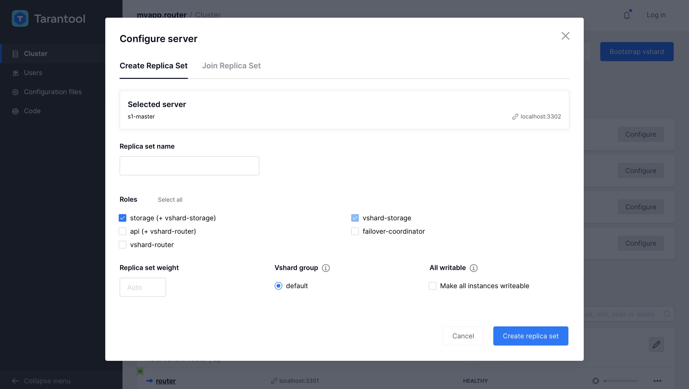
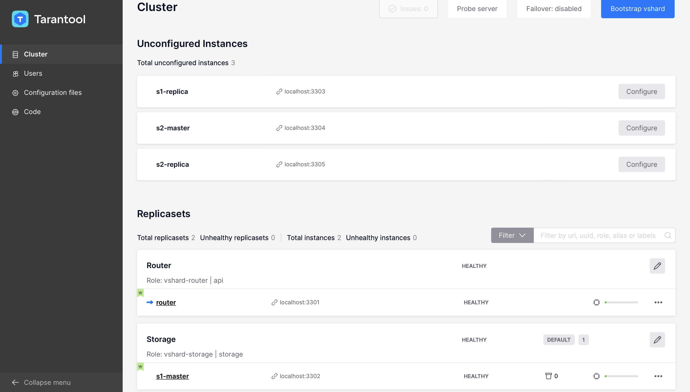

# Пример приложения на Tarantool Cartridge

## Задача

Мы реализуем простую, но показательную кластерную базу данных для ведения счетов
в банке. Вот что она будет уметь:

1. База данных:
   * Добавление пользователя со счетами.
   * Чтение информации о пользователе и его счетах.
   * Обновление счетов.
2. Возможность работать с кластером как с RESTful-сервером по протоколу http.
3. Тесты на luatest.

## Настройка окружения

Для начала разработки на `cartridge` нужно установить несколько утилит:

* `git` &mdash; система контроля версий (подробнее [тут](https://git-scm.com/))
* `cmake` версии не ниже 2.8
* `tarantool-devel` &mdash; пакет для разработки `tarantool`
* `gcc` &mdash; компилятор `C` (подробнее [тут](https://gcc.gnu.org/))
* `unzip`

Далее нужно установить последнюю помеченную версию утилиты `cartridge-cli` (не `scm-1` версия).

Для того, чтобы увидеть все доступные версии `cartridge-cli`, выполните:
```bash
you@yourmachine $ tarantoolctl rocks search cartridge-cli
```

Вы увидите примерно следующее:
```
cartridge-cli - Search results for Lua 5.1:
===========================================


Rockspecs and source rocks:
---------------------------

cartridge-cli
   scm-1 (rockspec) - http://rocks.tarantool.org
   1.7.0-1 (rockspec) - http://rocks.tarantool.org
   1.6.0-1 (rockspec) - http://rocks.tarantool.org
   1.5.0-1 (rockspec) - http://rocks.tarantool.org
   ...
```

Последняя помеченная версия `cartridge-cli` на момент написания статьи - `1.7.0-1`.
Поэтому, в данном случае надо установить версию `1.7.0-1`. Выполните следующее:

```bash
you@yourmachine $ tarantoolctl rocks install cartridge-cli 1.7.0
```

Также стоит добавить `.rocks/bin` в путь к исполняемым файлам:
```bash
you@yourmachine $ export PATH=$PWD/.rocks/bin/:$PATH
```

Готово!

## Быстрый способ разобраться

Вы можете сразу посмотреть, что вы получите в конце данного урока.
Для этого достаточно склонировать проект с репозитория и запустить уже готовое
решение:

```bash
you@yourmachine $ git clone https://github.com/tarantool/cartridge-cli
you@yourmachine $ cd cartridge-cli/examples/getting-started-app
```

После этого перейдите к разделу ["Запуск проекта"](#Запуск-проекта)
и выполните приведенные там инструкции.

Но мы настоятельно рекомендуем вам пройти весь путь шаг за шагом,
самостоятельно: так вы сможете гораздо глубже вникнуть в суть работы
с Tarantool Cartridge.

## Создание проекта

Нам не нужно создавать проект с нуля &mdash; можно воспользоваться уже готовыми
шаблонами. На данный момент есть 1 встроенный шаблон: `cartridge`.

В данном примере рассматривается шаблон `cartridge`, так как дальше мы будем
шардировать наше решение.

Создадим шаблон проекта, назвав его **`getting-started-app`** (вы можете выбрать
любое другое название).

```bash
you@yourmachine $ cartridge create --name getting-started-app
```

По завершении выполнения этой команды, в конце вывода мы увидим такое сообщение:

```bash
Application successfully created in './getting-started-app'
```

Рассмотрим структуру созданного проекта:

```bash
you@yourmachine $ cd getting-started-app
getting-started-app $ find . -not -path '*/\.*'
.
./init.lua
./app
./app/roles
./app/roles/custom.lua
./test
./test/unit
./test/unit/sample_test.lua
./test/integration
./test/integration/api_test.lua
./test/helper.lua
./test/helper
./test/helper/unit.lua
./test/helper/integration.lua
./cartridge.post-build
./Dockerfile.build.cartridge
./getting-started-app-scm-1.rockspec
./instances.yml
./deps.sh
./cartridge.pre-build
./tmp
./Dockerfile.cartridge
```

На самом деле, в шаблоне гораздо больше объектов &mdash; хотя бы потому, что
инициализируется `git`-репозиторий с настроенным файлом `.gitignore`.
Пока что обратим внимание только на следующие файлы и директории:

1. ```deps.sh``` &mdash; скрипт-однострочник для удобной установки пакетов,
необходимых для разработки и тестировани проекта (`luatest`, `luacheck`, `luacov` и т.д.)
2. ```init.lua``` &mdash; точка входа в наше приложение. В этом примере мы не будем
   подробно разбирать его, однако для разработки более сложных сервисов
   потребуется понимать, что происходит в этом скрипте.
3. ```app/roles``` &mdash; наша основная рабочая директория. В ней удобно описывать
   все роли.
4. ```getting-started-app-scm-1.rockspec``` &mdash; _"рокспека"_, это файл-манифест
   проекта. В данном уроке мы будем рассматривать только его часть, отвечающую
   за описание зависимостей проекта.

## Запуск

Уже в данном виде, сразу после создания из шаблона, проект почти готов к запуску.
Но сначала необходимо подтянуть зависимости. Чтобы это сделать, используйте команду
 `cartridge build` в корне проекта:

```bash
getting-started-app $ cartridge build
```

Все необходимые модули должны подтянуться в директорию `.rocks`.

Если не подтягивать зависимости, то проект не запустится и мы увидим что-то
подобное:

```bash
getting-started-app $ tarantool init.lua
init.lua:62: module 'cartridge' not found:No LuaRocks module found for cartridge
    no field package.preload['cartridge']
    no file '/Users/aleksander.kuznetsov/projects/getting-started-app/cartridge.lua'
    no file '/Users/aleksander.kuznetsov/projects/getting-started-app/cartridge/init.lua'
    no file '/Users/aleksander.kuznetsov/projects/getting-started-app/cartridge.dylib'
    no file '/Users/aleksander.kuznetsov/projects/getting-started-app/cartridge.so'
    ...
```

Сразу установим и пакеты, необходимые для разработки и тестирования (`luatest`, `luacheck`, `luacov` и т.д.):

```bash
getting-started-app $ ./deps.sh
```

Если все сделано верно и директория `.rocks` создалась, то мы уже можем запустить
"пустой" экземпляр.

```bash
getting-started-app $ tarantool init.lua
Using advertise_uri "localhost:3301"
Membership encryption enabled
Membership BROADCAST sent to 127.0.0.1:3302
Membership BROADCAST sent to 192.168.43.255:3302
Membership BROADCAST sent to 127.0.0.1:3301
Membership BROADCAST sent to 192.168.43.255:3301
Membership BROADCAST sent to 127.0.0.1:3300
Membership BROADCAST sent to 192.168.43.255:3300
started
Listening HTTP on 0.0.0.0:8081
Ready for bootstrap
entering the event loop
```

Обратите внимание на эту строку:

```bash
Listening HTTP on 0.0.0.0:8081
```

Это значит, что http-сервер уже запущен и слушает 8081 порт нашего компьютера.
Перейдем по адресу http://127.0.0.1:8081 в браузере и увидим веб-интерфейс
кластера, который состоит из одного экземпляра Tarantool.

Остановим приложение с помощью Ctrl+C и начнем писать код.

## Немного о ролях

Роль &mdash; это часть нашего приложения, логически обособленная от других частей.

Чтобы реализовать роль, которая будет работать на кластере, то &mdash; помимо описания
бизнес-логики этой роли &mdash; нам необходимо написать несколько функций обратного
вызова, через которые кластер и будет управлять жизненным циклом нашей роли.

Список этих функций невелик, и почти все из них уже реализованы заглушками при
генерации проекта из шаблона. Вот, что мы найдем в `app/roles/custom.lua`:

* `init(opts)` &mdash; создание роли и ее инициализация.
* `stop()` &mdash; завершение работы роли;
* `validate_config(conf_new, conf_old)` &mdash; функция валидирования новой
  конфигурации нашей роли;
* `apply_config(conf, opts)` &mdash; применение новой конфигурации.

Сам файл роли &mdash; это просто Lua-модуль, в конце которого
должен быть реализован экспорт необходимых функций и переменных:

```lua
return {
    role_name = 'custom_role',
    init = init,
    stop = stop,
    validate_config = validate_config,
    apply_config = apply_config,
    dependencies = {},
}
```

Разобьем наше приложение на 2 роли:

1. Роль `storage` реализовывает хранение и изменение информации о пользователях
   и счетах.
1. Роль `api` реализовывает RESTful http-сервер.

## Реализация бизнес-логики

### Роль `storage`

Создадим новый файл, где реализуем эту роль:

```bash
getting-started-app $ touch app/roles/storage.lua
```

1. Подключим необходимые модули:

    ```lua
    -- модуль проверки аргументов в функциях
    local checks = require('checks')

    -- модуль работы с числами
    local decnumber = require('ldecnumber')
    ```

1. Реализуем инициализацию необходимого пространства в хранилище:

    ```lua
    local function init_spaces()
        local customer = box.schema.space.create(
            -- имя спейса для хранения пользователей
            'customer',
            -- дополнительные параметры
            {
                -- формат хранимых кортежей
                format = {
                    {'customer_id', 'unsigned'},
                    {'bucket_id', 'unsigned'},
                    {'name', 'string'},
                },
                -- создадим спейс, только если его не было
                if_not_exists = true,
            }
        )

        -- создадим индекс по id пользователя
        customer:create_index('customer_id', {
            parts = {'customer_id'},
            if_not_exists = true,
        })

        customer:create_index('bucket_id', {
            parts = {'bucket_id'},
            unique = false,
            if_not_exists = true,
        })

        -- аналогично, создаем спейс для учетных записей (счетов)
        local account = box.schema.space.create('account', {
            format = {
                {'account_id', 'unsigned'},
                {'customer_id', 'unsigned'},
                {'bucket_id', 'unsigned'},
                {'balance', 'string'},
                {'name', 'string'},
            },
            if_not_exists = true,
        })

        -- аналогичные индексы
        account:create_index('account_id', {
            parts = {'account_id'},
            if_not_exists = true,
        })
        account:create_index('customer_id', {
            parts = {'customer_id'},
            unique = false,
            if_not_exists = true,
        })

        account:create_index('bucket_id', {
            parts = {'bucket_id'},
            unique = false,
            if_not_exists = true,
        })
    end
    ```

1. Функция добавления нового пользователя:

    ```lua
    local function customer_add(customer)
        customer.accounts = customer.accounts or {}

        -- открытие транзакции
        box.begin()

        -- вставка кортежа в спейс customer
        box.space.customer:insert({
            customer.customer_id,
            customer.bucket_id,
            customer.name
        })
        for _, account in ipairs(customer.accounts) do
            -- вставка кортежей в спейс account
            box.space.account:insert({
                account.account_id,
                customer.customer_id,
                customer.bucket_id,
                '0.00',
                account.name
            })
        end

        -- коммит транзакции
        box.commit()
        return true
    end
    ```
1. Функция обновления счета:

   ```lua
   local function update_balance(balance, amount)
        -- конвертируем строку с балансом в число
        local balance_decimal = decnumber.tonumber(balance)
        balance_decimal = balance_decimal + amount
        if balance_decimal:isnan() then
            error('Invalid amount')
        end

        -- округляем до 2-х знаков после запятой и конвертируем баланс
        -- обратно в строку
        return balance_decimal:rescale(-2):tostring()
    end
    ```

1. Функция обновления счета аккаунта:

    ```lua
    local function customer_update_balance(customer_id, account_id, amount)
        -- проверка аргументов функции
        checks('number', 'number', 'string')

        -- находим требуемый счет в базе данных
        local account = box.space.account:get(account_id)
        if account == nil then   -- проверяем, найден ли этот счет
            return nil
        end

        -- проверяем, принадлежит ли запрашиваемый счет пользователю
        if account.customer_id ~= customer_id then
            error('Invalid account_id')
        end

        local new_balance = update_balance(account.balance, amount)

        -- обновляем баланс
        box.space.account:update({ account_id }, {
            { '=', 4, new_balance }
        })

        return new_balance
    end
    ```

1. Функция получения информации о пользователе:

    ```lua
    local function customer_lookup(customer_id)
        checks('number')

        local customer = box.space.customer:get(customer_id)
        if customer == nil then
            return nil
        end
        customer = {
            customer_id = customer.customer_id;
            name = customer.name;
        }
        local accounts = {}
        for _, account in box.space.account.index.customer_id:pairs(customer_id) do
            table.insert(accounts, {
                account_id = account.account_id;
                name = account.name;
                balance = account.balance;
            })
        end
        customer.accounts = accounts;

        return customer
    end
    ```

1. Функция инициализации роли `storage`:

    ```lua
    local exported_functions = {
        customer_add = customer_add,
        customer_lookup = customer_lookup,
        customer_update_balance = customer_update_balance,
    }

    local function init(opts)
        if opts.is_master then
            -- вызываем функцию инициализацию спейсов
            init_spaces()

            for name in pairs(exported_functions) do
                box.schema.func.create(name, {if_not_exists = true})
                box.schema.role.grant('public', 'execute', 'function', name, {if_not_exists = true})
            end
        end

        for name, func in pairs(exported_functions) do
            rawset(_G, name, func)
        end

        return true
    end
    ```

1. Экспортируем функции роли и зависимости из модуля:

    ```lua
    return {
        role_name = 'storage',
        init = init,
        -- для дальнейшего тестирования
        utils = {
            update_balance = update_balance
        },
        dependencies = {
            'cartridge.roles.vshard-storage',
        },
    }
    ```

Первая роль готова!

### Роль `api`

1. Подключим необходимые модули:

    ```lua
    local vshard = require('vshard')
    local cartridge = require('cartridge')
    local errors = require('errors')
    ```

1. Создадим классы ошибок:

    ```lua
    local err_vshard_router = errors.new_class("Vshard routing error")
    local err_httpd = errors.new_class("httpd error")
    ```

1. Обработчик http-запроса (добавление пользователя):

    ```lua
    local function http_customer_add(req)
        local customer = req:json()

        local bucket_id = vshard.router.bucket_id(customer.customer_id)
        customer.bucket_id = bucket_id

        local _, error = err_vshard_router:pcall(
            vshard.router.call,
            bucket_id,
            'write',
            'customer_add',
            {customer}
        )

        if error then
            local resp = req:render({json = {
                info = "Internal error",
                error = error
            }})
            resp.status = 500
            return resp
        end

        local resp = req:render({json = { info = "Successfully created" }})
        resp.status = 201
        return resp
    end
    ```

1. Обработчик http-запроса (получение информации о пользователе):

    ```lua
    local function http_customer_get(req)
        local customer_id = tonumber(req:stash('customer_id'))

        local bucket_id = vshard.router.bucket_id(customer_id)

        local customer, error = err_vshard_router:pcall(
            vshard.router.call,
            bucket_id,
            'read',
            'customer_lookup',
            {customer_id}
        )

        if error then
            local resp = req:render({json = {
                info = "Internal error",
                error = error
            }})
            resp.status = 500
            return resp
        end

        if customer == nil then
            local resp = req:render({json = { info = "Customer not found" }})
            resp.status = 404
            return resp
        end

        customer.bucket_id = nil
        local resp = req:render({json = customer})
        resp.status = 200
        return resp
    end
    ```

1. Обработчик http-запроса (обновление счета пользователя):

    ```lua
    local function http_customer_update_balance(req)
        local customer_id = tonumber(req:stash('customer_id'))
        local body = req:json()
        local account_id = tonumber(body["account_id"])
        local amount = body["amount"]

        local bucket_id = vshard.router.bucket_id(customer_id)

        local balance, error = err_vshard_router:pcall(
            vshard.router.call,
            bucket_id,
            'read',
            'customer_update_balance',
            {customer_id, account_id, amount}
        )

        if error then
            local resp = req:render({json = {
                info = "Internal error",
                error = error
            }})
            resp.status = 500
            return resp
        end

        if balance == nil then
            local resp = req:render({json = { info = "Account not found" }})
            resp.status = 404
            return resp
        end

        local resp = req:render({json = {balance = balance}})
        resp.status = 200
        return resp
    end
    ```

1. Инициализация роли:

    ```lua
    local function init(opts)
        rawset(_G, 'vshard', vshard)

        if opts.is_master then
            box.schema.user.grant('guest',
                'read,write,execute',
                'universe',
                nil, { if_not_exists = true }
            )
        end

        local httpd = cartridge.service_get('httpd')

        if not httpd then
            return nil, err_httpd:new("not found")
        end

        -- Навешиваем функции-обработчики
        httpd:route(
            { path = '/storage/customers/create', method = 'POST', public = true },
            http_customer_add
        )
        httpd:route(
            { path = '/storage/customers/:customer_id', method = 'GET', public = true },
            http_customer_get
        )
        httpd:route(
            { path = '/storage/customers/:customer_id/update_balance', method = 'POST', public = true },
            http_customer_update_balance
        )

        return true
    end
    ```

1. Экспортируем функции роли и зависимости из модуля:

    ```lua
    return {
        role_name = 'api',
        init = init,
        dependencies = {'cartridge.roles.vshard-router'},
    }
    ```

## Добавим зависимости и вспомогательные скрипты

Из репозитория с этим примером перенесем к себе в корень проекта
файл `instances.yml` &mdash; пример файла конфигурации для запуска 5 экземпляров.

Почти все готово. Осталось лишь прописать наши новые роли в файле `init.lua`
в корне проекта:

```lua
local cartridge = require('cartridge')
local ok, err = cartridge.cfg({
    roles = {
        'cartridge.roles.vshard-storage',
        'cartridge.roles.vshard-router',
        'cartridge.roles.metrics',
        'app.roles.api',
        'app.roles.storage',
    },
    cluster_cookie = 'getting-started-app-cluster-cookie',
})
```

А также учесть, что в наших ролях мы использовали некоторые внешние модули.
Их необходимо добавить в список зависимостей в рокспеке
(файл `getting-started-app-scm-1.rockspec`):

```lua
package = 'getting-started-app'
version = 'scm-1'
source  = {
    url = '/dev/null',
}
-- Put any modules your app depends on here
dependencies = {
    'tarantool',
    'lua >= 5.1',
    'checks == 3.1.0-1',
    'cartridge == 2.7.7-1',
    'ldecnumber == 1.1.3-1',
    'metrics == 0.15.1-1',
}
build = {
    type = 'none';
}
```

## Запуск проекта

Можем запускать кластер!

```bash
getting-started-app $ cartridge build
getting-started-app $ cartridge start -d
```

Откроем в браузере веб-интерфейс и сделаем следующее:

1. Создадим в одном экземпляре роль `'api'`.


1. Создадим на другом экземпляре роль `'storage'`.



Должны создаться 2 репликасета по одному экземпляру Tarantool в каждом.



Теперь у нас есть 2 репликасета с двумя ролями, но `vshard` еще не запущен.
Нажмем кнопку `Bootstrap vshard` на закладке Cluster в веб-интерфейсе.

Также для стабильной работы необходимо включить фейловер. Откроем вкладку `Failover control` и нажмем `Apply`.


Также вы можете использовать `cartridge-cli` для настройки всех инстансов и фейловера:

```bash
cartridge replicasets setup --bootstrap-vshard
cartridge failover set stateful --state-provider stateboard --provider-params '{"uri": "localhost:4401", "password": "passwd"}'
```

Откроем новую консоль и добавим пользователя через `curl`:

```bash
getting-started-app $ curl -X POST -v -H "Content-Type: application/json" -d '{"customer_id":18, "name": "Victor"}' http://localhost:8081/storage/customers/create
```

В ответе мы должны увидеть примерно следующее:

```bash
*   Trying ::1...
* TCP_NODELAY set
* Connection failed
* connect to ::1 port 8081 failed: Connection refused
*   Trying 127.0.0.1...
* TCP_NODELAY set
* Connected to localhost (127.0.0.1) port 8081 (#0)
> POST /storage/customers/create HTTP/1.1
> Host: localhost:8081
> User-Agent: curl/7.54.0
> Accept: */*
> Content-Type: application/json
> Content-Length: 51
>
* upload completely sent off: 51 out of 51 bytes
< HTTP/1.1 201 Created
< Content-length: 31
< Server: Tarantool http (tarantool v1.10.3-94-g98964ba8d)
< Content-type: application/json; charset=utf-8
< Connection: keep-alive
<
* Connection #0 to host localhost left intact
{"info":"Successfully created"}
```

Отлично! Теперь перейдем к тестам, но для начала остановим кластер, нажав Ctrl+C.

## Тестирование

Тесты на [luatest](https://github.com/tarantool/luatest/) уже реализованы в репозитории.
Перенесем всю директорию
[test](https://github.com/tarantool/cartridge-cli/tree/master/examples/getting-started-app/test)
в свой проект вместо уже имеющейся.

Если Вы не установили пакеты, необходимые для разработки и тестирования, то сделайте это:
```bash
getting-started-app $ ./deps.sh
```

Написание тестов &mdash; тема для отдельного урока. Сейчас же мы запустим тесты,
заранее написанные для этого примера:

```bash
getting-started-app $ .rocks/bin/luatest
```

Вывод должен быть примерно таким:

```bash
..
Ran 2 tests in 0.021 seconds, 2 successes, 0 failures
OK
```
Вы также можете проверить покрытие кода тестами с помощью `luacov`.

Запустите `luatest` с флагом `--coverage`:

``` bash
getting-started-app $ .rocks/bin/luatest --coverage
```

Сгенерируйте отчет:

``` bash
getting-started-app $ .rocks/bin/luacov
```

Выведите итог:

``` bash
getting-started-app $ grep -A999 '^Summary' tmp/luacov.report.out
```

Далее при генерации отчетов не забывайте удалять предыдущие отчеты перед
созданием новых:

``` bash
getting-started-app $ rm -f tmp/luacov.*.out*
```
